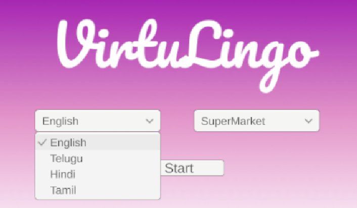
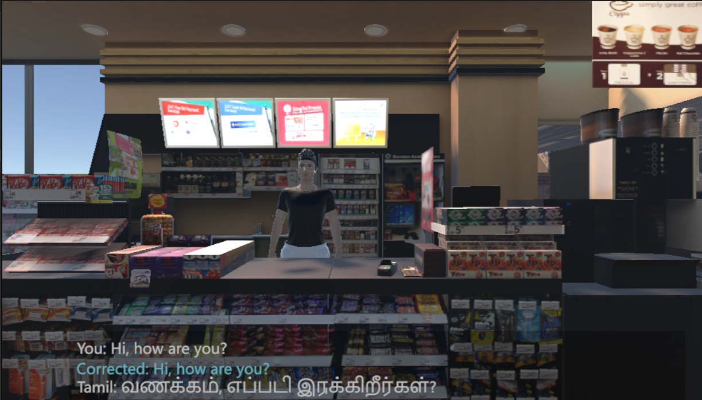
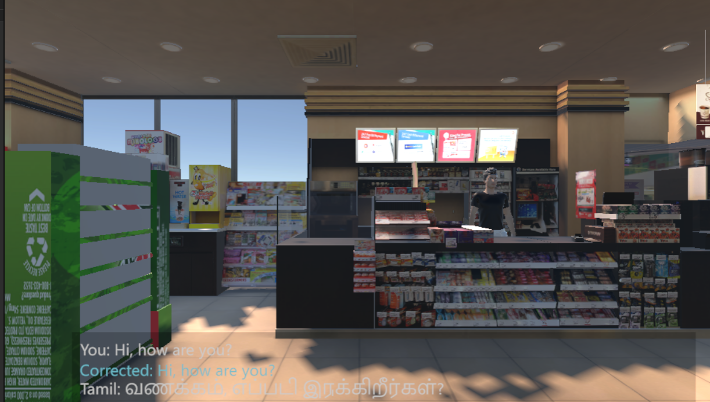
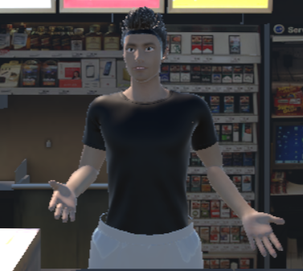
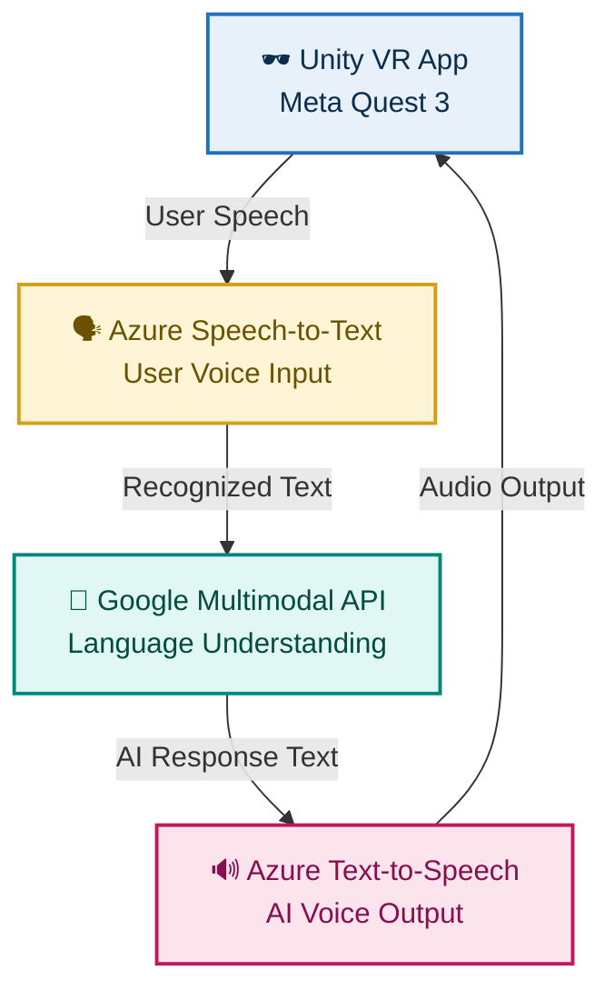
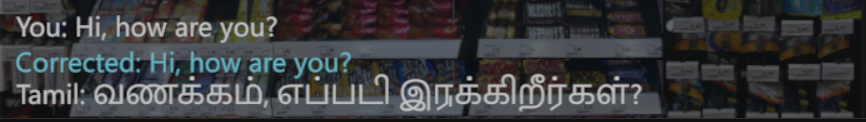
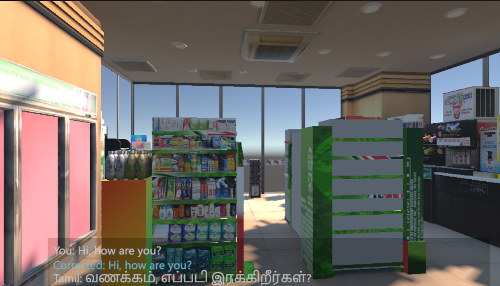

# **VirtuLingo — Immersive AR/VR Language Learning**

**VirtuLingo** transforms language learning by placing learners inside realistic VR conversations with AI-powered virtual characters.
Instead of memorizing vocabulary or repeating textbook drills, users build true fluency through **natural, contextual, spoken interaction** in a safe, judgment-free world.

Designed for young learners, beginners, and people who struggle with verbal communication, VirtuLingo blends **VR immersion + AI language intelligence** to provide human-like conversations, instant feedback, and scenario-based learning.

---

# **Features**

* Personalized, dynamic conversations that respond to the user’s speech
* Multiple real-life VR scenarios (restaurants, supermarkets, offices, etc.)
* Real-time feedback on pronunciation, grammar, and fluency
* Context-aware vocabulary guidance during interactions
* AI-driven conversation partners with adaptive difficulty
* Safe, goal-oriented, judgment-free speaking environment
* Meta Quest 3 optimized VR experience

---

# **Interface Overview**

<div align="center">







</div>

---

# **Tech Stack & Architecture**

<table>
<tr>
<td width="260" valign="top">

### **Tech Stack**

<table>

<!-- UNITY -->

<tr>
<td align="center">
<b style="font-size:16px;">UNITY ENGINE</b><br/><br/>
<code style="font-size:15px;">Unity 3D • XR Interaction Toolkit</code><br/><br/>
<strong>VR Environments • Gameplay Logic • Scene Management</strong>
</td>
</tr>

<tr><td align="center"><strong>↓ VR Interaction Layer</strong></td></tr>

<!-- MODELLING -->

<tr>
<td align="center">
<b style="font-size:16px;">3D ASSET CREATION</b><br/><br/>
<code style="font-size:15px;">Daz 3D • Blender • Sketchfab</code><br/><br/>
<strong>Characters • Animations • Props • Environments</strong>
</td>
</tr>

<tr><td align="center"><strong>↓ Voice Processing</strong></td></tr>

<!-- SPEECH -->

<tr>
<td align="center">
<b style="font-size:16px;">VOICE PROCESSING</b><br/><br/>
<code style="font-size:15px;">Azure Speech-to-Text</code><br/>
<code style="font-size:15px;">Azure Text-to-Speech</code><br/><br/>
<strong>Real-time Speech Recognition • AI Narration</strong>
</td>
</tr>

<tr><td align="center"><strong>↓ Language Intelligence</strong></td></tr>

<!-- LLM -->

<tr>
<td align="center">
<b style="font-size:16px;">LANGUAGE AI ENGINE</b><br/><br/>
<code style="font-size:15px;">Google Multimodal API</code><br/><br/>
<strong>Dialogue Understanding • Dynamic Response Generation</strong>
</td>
</tr>

<tr><td align="center"><strong>↓ Deployment</strong></td></tr>

<!-- VR DEVICE -->

<tr>
<td align="center">
<b style="font-size:16px;">META QUEST 3</b><br/><br/>
<code style="font-size:15px;">VR Deployment Target</code><br/><br/>
<strong>Standalone VR Experience</strong>
</td>
</tr>

</table>

</td>

<td width="1000" valign="center" align="center">

### **Visual Flow**



</td>
</tr>
</table>

---

# 🧩 **System Modules**

<table>

<tr><td colspan="2"><strong>CONVERSATION ENGINE</strong></td></tr>
<tr>
  <td width="40%">
    • AI-driven NPC dialogue<br>
    • Difficulty adapts to user proficiency<br>
    • Context-based intent detection<br>
    • Generates natural, scenario-focused responses  
  </td>
  <td width="60%" align="center">
</td>
</tr>

<tr><td colspan="2"><strong>REAL-TIME FEEDBACK MODULE</strong></td></tr>
<tr>
  <td width="40%">
    • Instant corrective suggestions<br>
    • Encouraging, non-judgmental guidance  
  </td>
  <td width="60%" align="center">
</td>
</tr>

<tr><td colspan="2"><strong>SCENARIO TRAINING MODULE</strong></td></tr>
<tr>
  <td width="40%">
    • Restaurants, supermarkets,etc<br>
    • Vocabulary hints embedded in the environment  
  </td>
  <td width="60%" align="center">
</td>
</tr>

<tr><td colspan="2"><strong>VOICE PROCESSING MODULE</strong></td></tr>
<tr>
  <td width="40%">
    • Converts speech → text (Azure STT)<br>
    • Sends parsed text to AI model<br>
    • Receives synthesized speech (Azure TTS)<br>
  </td>
  <td width="60%" align="center">-
</td>
</tr>

</table>

---

# **Installation**

## **1. Clone the Repository**

```bash
git clone https://github.com/Kathirvelan213/VirtuLingo.git
cd VirtuLingo
```

## **2. Unity Setup**

1. Open Unity Hub
2. Load the project folder
3. Ensure required Unity packages are installed:

   * XR Interaction Toolkit
   * OpenXR Plugin
   * Unity Web Request / Networking

## **3. Configure APIs**

Edit your environment file or Unity scriptable objects:

* Azure Speech Key
* Azure Region
* Google API Key / Model Names

## **4. Build for Meta Quest 3**

* Switch platform → Android
* Set XR Plugin → OpenXR
* Enable Oculus Quest support
* Build & Run

